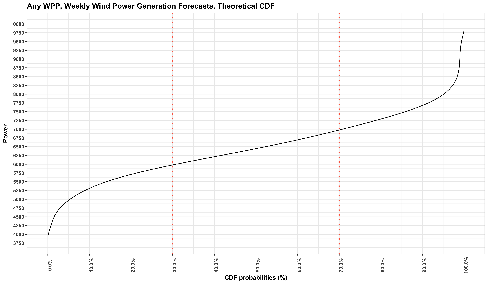

# Probabilistic Wind Power Forecasting with R

This repository introduces the ensemble forecasts and how to apply theoretical and empirical cumulative distribution functions to a sample power forecast data for a wind farm by using R.  Regarding to the probabilistic forecasting which is discussed, some useful functions are also created.

R Markdown and html output for general overview can be downloaded.

